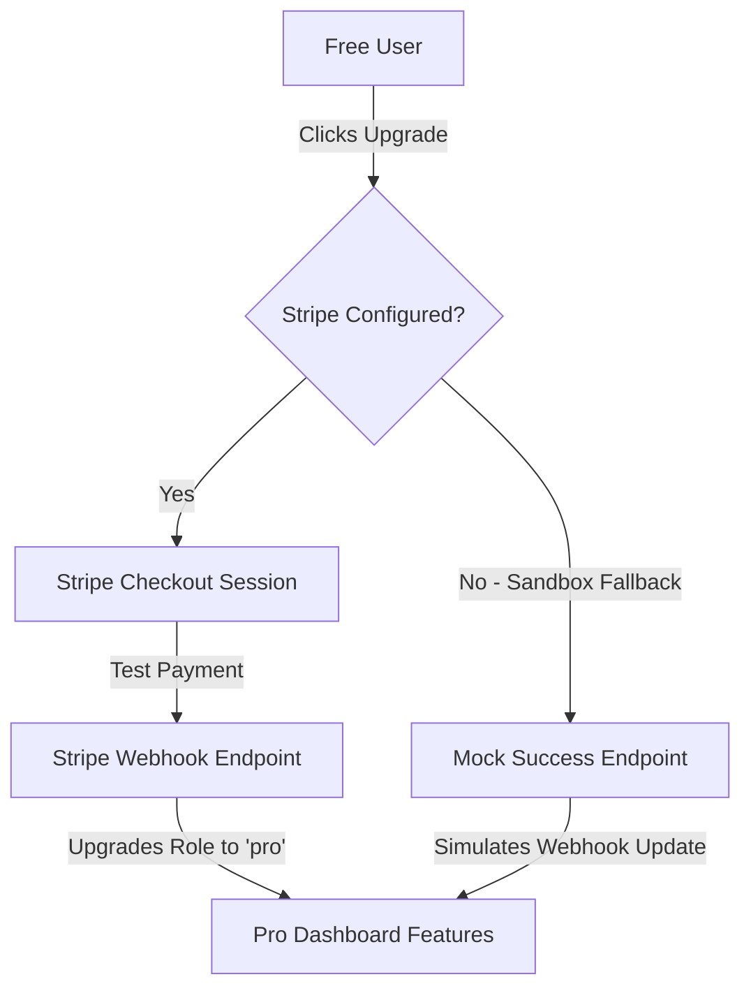

# Walkthrough - ResumeAces SaaS Product

Welcome to **ResumeAces** — a premium, full-stack, end-to-end AI Resume Reviewer SaaS product. This walkthrough details the system architecture, features, database schema, payment flow, and instructions to run and deploy the product.

---

## 🌟 Key Features

1. **Premium Landing Page**: A landing page with dark aesthetics, glassmorphism, responsive navigation, feature grids, step-by-step guidance, and a comprehensive pricing table (Free vs. Pro).
2. **Session-Cookie / JWT Auth**: Custom-built secure authentication that persists session state across page refreshes.
3. **Core AI Analyzer**: Paste a resume and target job description to run a scan. The system calculates an ATS match compatibility score (0-100%) and provides lists of strengths, critical gaps, missing and matching keywords, and paragraph-by-paragraph recommendations.
4. **Subscription-Tier Gating**: Gating restricts Free users to 3 scans per day. Gating checks are calculated on the database layer and checked at the server boundary. Pro users have unlimited scans.
5. **Stripe Integration & Sandbox Webhooks**: Integrated Stripe subscriptions using dynamic pricing (no need to pre-create products). Webhooks handle upgrades.
6. **Billing & Cancellation Portal**: Pro subscribers can click "Manage Subscription" to launch the Stripe Billing Portal or immediately trigger local/API cancellation.
7. **Zero-Config Fallbacks**: If keys are missing (Stripe/Gemini), the application uses intelligent heuristic fallback parsers and sandboxed billing routes to remain 100% testable and functional out-of-the-box.

---

## 🏗️ Architecture & Database

Unified database modeling is powered by **Prisma 6** and **SQLite** locally. It is pre-configured to easily change database providers to **PostgreSQL** (e.g., Neon or Supabase) for Vercel deployment.

### Schema Models

- **User**: Stores emails, hashed passwords, plan roles (`free` or `pro`), and Stripe customer/subscription IDs.
- **ResumeReview**: Stores scanned inputs, computed match score, and full JSON feedback analysis.
- **UsageLog**: Chronologically logs scans to calculate rate limits (e.g. 3 scans in the last 24 hours).

---

## 💳 Checkout & Upgrade Flow

We support two modes of payment and upgrade testing:



---

## ⚙️ Running Locally

### 1. Configure `.env`
Create a `.env` file in the root directory:
```env
DATABASE_URL="file:./dev.db"
JWT_SECRET="super-secret-key-for-development"
NEXT_PUBLIC_APP_URL="http://localhost:3000"

# (Optional) Real Gemini and Stripe integration keys
GEMINI_API_KEY="your-gemini-api-key"
STRIPE_SECRET_KEY="sk_test_..."
STRIPE_WEBHOOK_SECRET="whsec_..."
```

### 2. Initialize Database & Run Server
Run the following commands to synchronize the schema and start the dev server:
```bash
npx prisma db push
npm run dev
```

### 3. Testing Stripe Webhooks Locally
To test webhook events with the Stripe CLI:
```bash
stripe listen --forward-to localhost:3000/api/webhook
```

---

## 🚀 Deployment Instructions

### Vercel + Neon Postgres (Recommended)

1. **Database Setup**: Create a free Postgres instance on [Neon](https://neon.tech) and copy the connection string.
2. **Schema Update**: Update `prisma/schema.prisma` to use the Postgres datasource:
   ```prisma
   datasource db {
     provider = "postgresql"
     url      = env("DATABASE_URL")
   }
   ```
3. **Deploy on Vercel**: Connect your GitHub repository to Vercel. Add the following environment variables:
   - `DATABASE_URL` (Neon Postgres URI)
   - `JWT_SECRET` (Random secret key)
   - `NEXT_PUBLIC_APP_URL` (Your production Vercel URL)
   - `GEMINI_API_KEY` (Your Google Gemini key)
   - `STRIPE_SECRET_KEY` / `STRIPE_WEBHOOK_SECRET`
4. Vercel automatically detects the Next.js framework, runs `prisma generate`, compiles the static and dynamic pages, and deploys it live.
